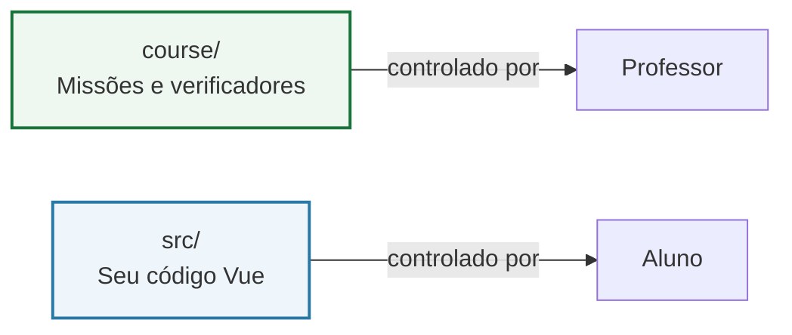
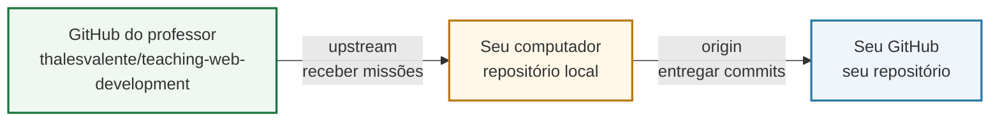
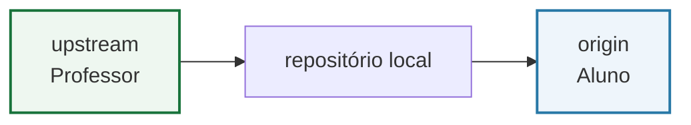
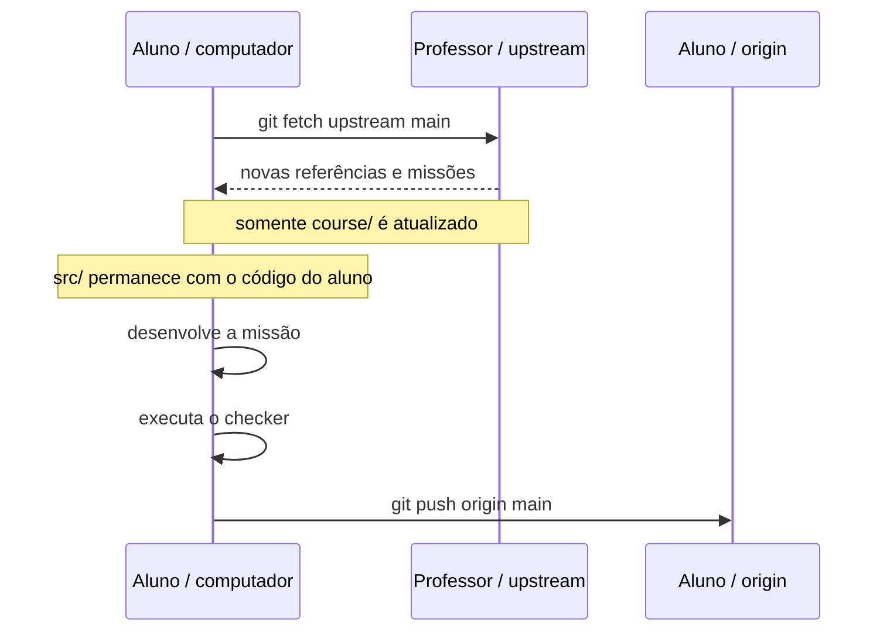
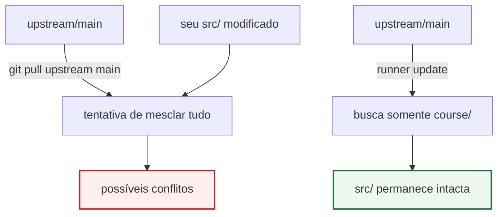
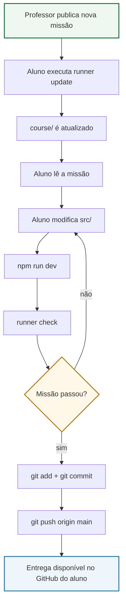
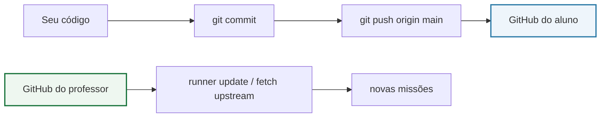
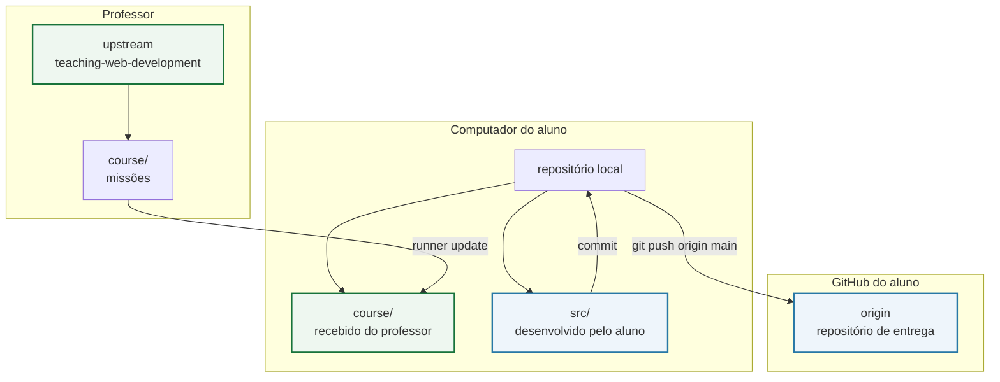

# Guia do aluno — como receber novas missões sem perder seu código

> **Desenvolvimento de Sistemas Web — IFMA Campus Itapecuru-Mirim**  
> Projeto-base: `lessons/aula-02-vite-vue-componentizacao`

A partir da Aula 3, o projeto deixa de ser descartável: **você continuará evoluindo o mesmo projeto Vue ao longo das aulas**.

A ideia é simples:

- o **professor** publica novas missões e arquivos de apoio;
- você **recebe essas atualizações**;
- seu código em `src/` continua sendo seu;
- você **entrega o trabalho no seu próprio repositório GitHub**.

Para isso, usaremos dois endereços Git no mesmo repositório:

- `origin` → **seu repositório** no GitHub;
- `upstream` → **repositório do professor**.

---

## 1. O projeto que continuará evoluindo

No repositório da disciplina, o projeto-base está em:

```text
lessons/aula-02-vite-vue-componentizacao/
```

Ele já contém a aplicação Vue criada na Aula 2:

```text
lessons/aula-02-vite-vue-componentizacao/
├── package.json
├── package-lock.json
├── vite.config.js
├── src/
│   ├── App.vue
│   ├── main.js
│   ├── style.css
│   └── components/
│       ├── AppHeader.vue
│       ├── ProjectCard.vue
│       └── AppFooter.vue
└── ...
```

A partir das próximas aulas, essa pasta passa a funcionar como o **projeto vivo da disciplina**.

Quando o sistema de missões for habilitado, aparecerá também:

```text
lessons/aula-02-vite-vue-componentizacao/
├── course/                  ← controlado pelo professor
│   ├── runner.mjs
│   ├── manifest.json
│   └── missions/
├── src/                     ← código desenvolvido pelo aluno
├── package.json
└── ...
```

### Regra mais importante



> **Não edite a pasta `course/`**, a menos que o professor peça.  
> O trabalho da equipe deve acontecer principalmente em `src/`.

---

# 2. O que são `origin` e `upstream`?

Pense nos remotes como dois destinos diferentes.



| Nome | Para onde aponta? | Para que serve? |
|---|---|---|
| `origin` | seu repositório GitHub | enviar seus commits e entregar o trabalho |
| `upstream` | repositório do professor | receber novas missões e materiais oficiais |

O endereço do `upstream` da disciplina é:

```text
https://github.com/thalesvalente/teaching-web-development.git
```

---

# 3. Configuração recomendada: faça um Fork

Se você ainda vai configurar seu repositório, este é o caminho recomendado.

## Passo 1 — Faça o Fork no GitHub

Abra o repositório do professor:

```text
https://github.com/thalesvalente/teaching-web-development
```

Clique em **Fork** e crie uma cópia na sua conta.

Exemplo:

```text
Professor:
https://github.com/thalesvalente/teaching-web-development

Aluno:
https://github.com/SEU_USUARIO/teaching-web-development
```

## Passo 2 — Clone o SEU repositório

Troque `SEU_USUARIO` pelo seu usuário do GitHub:

```powershell
git clone https://github.com/SEU_USUARIO/teaching-web-development.git
cd teaching-web-development
```

Nesse momento, `origin` já deve apontar para você.

Confira:

```powershell
git remote -v
```

Você deverá ver algo parecido com:

```text
origin  https://github.com/SEU_USUARIO/teaching-web-development.git (fetch)
origin  https://github.com/SEU_USUARIO/teaching-web-development.git (push)
```

## Passo 3 — Adicione o repositório do professor como `upstream`

Execute uma única vez:

```powershell
git remote add upstream https://github.com/thalesvalente/teaching-web-development.git
```

Confira novamente:

```powershell
git remote -v
```

Resultado esperado:

```text
origin    https://github.com/SEU_USUARIO/teaching-web-development.git (fetch)
origin    https://github.com/SEU_USUARIO/teaching-web-development.git (push)
upstream  https://github.com/thalesvalente/teaching-web-development.git (fetch)
upstream  https://github.com/thalesvalente/teaching-web-development.git (push)
```

> Você **não fará `push` para `upstream`**.  
> Sua entrega sempre vai para `origin`.

---

# 4. Se você JÁ clonou o repositório do professor

Talvez você tenha começado assim:

```powershell
git clone https://github.com/thalesvalente/teaching-web-development.git
```

Nesse caso, provavelmente seu `origin` ainda aponta para o professor.

Confira antes de fazer qualquer alteração:

```powershell
git remote -v
```

Se aparecer:

```text
origin  https://github.com/thalesvalente/teaching-web-development.git
```

faça a migração abaixo.

## Passo 1 — Transforme o `origin` atual em `upstream`

```powershell
git remote rename origin upstream
```

## Passo 2 — Crie um repositório vazio na sua conta GitHub

Crie um repositório na sua conta. Para evitar conflitos, prefira criá-lo **sem README, sem `.gitignore` e sem licença**.

Exemplo:

```text
https://github.com/SEU_USUARIO/teaching-web-development
```

## Passo 3 — Adicione seu repositório como `origin`

```powershell
git remote add origin https://github.com/SEU_USUARIO/teaching-web-development.git
```

## Passo 4 — Envie o histórico que já está no seu computador

```powershell
git push -u origin main
```

Depois confira:

```powershell
git remote -v
```

Agora a configuração deve ser:



---

# 5. Se seu `origin` JÁ é seu repositório

Se `git remote -v` já mostrar seu GitHub em `origin`, não altere esse remote.

Adicione apenas o professor:

```powershell
git remote add upstream https://github.com/thalesvalente/teaching-web-development.git
```

Se aparecer a mensagem de que `upstream` já existe, **não tente substituir automaticamente**. Execute:

```powershell
git remote -v
```

Confira para onde ele aponta e, se estiver diferente do endereço da disciplina, chame o professor.

---

# 6. Onde executar os comandos das missões

Primeiro entre no projeto Vue da Aula 2:

```powershell
cd lessons/aula-02-vite-vue-componentizacao
```

Confira se está na pasta correta:

```powershell
dir
```

Você deve encontrar, entre outros arquivos:

```text
package.json
package-lock.json
src/
vite.config.js
```

Quando a pasta `course/` estiver disponível, os comandos das missões serão executados **nesta pasta**.

---

# 7. Como receber uma nova missão

Antes de atualizar, salve seu trabalho atual em um commit.

```powershell
git status
```

Se houver alterações suas ainda não registradas:

```powershell
git add .
git commit -m "feat: salva progresso antes da nova missao"
```

Depois execute:

```powershell
node course/runner.mjs update
```

O atualizador fará a operação de forma seletiva:



O resultado esperado no terminal será parecido com:

```text
✓ origin do aluno preservado
✓ remote upstream já configurado
• buscando novas missões em upstream/main...
✓ missões atualizadas
✓ src/ preservada — nenhum arquivo do código do aluno foi sobrescrito
```

---

# 8. Por que NÃO usamos `git pull upstream main`?

Não use este comando, salvo orientação explícita do professor:

```powershell
git pull upstream main
```

O motivo é que `pull` tenta integrar **todo o conteúdo** do repositório do professor com o seu.

Como você estará modificando `src/App.vue`, `ProjectCard.vue` e outros arquivos, isso pode gerar conflitos desnecessários.



Em termos simples:

- `git fetch upstream` → **consulta** o que existe no repositório do professor;
- `git pull upstream main` → consulta **e tenta misturar tudo**;
- `node course/runner.mjs update` → consulta o professor e **atualiza apenas as missões**.

---

# 9. Fluxo normal de uma aula

Quando o sistema de missões estiver ativo, o fluxo será aproximadamente este.

## 1. Entrar no projeto

```powershell
cd lessons/aula-02-vite-vue-componentizacao
```

## 2. Conferir seu Git

```powershell
git status
git remote -v
```

## 3. Receber novas missões

```powershell
node course/runner.mjs update
```

## 4. Ver as missões disponíveis

```powershell
node course/runner.mjs status
```

## 5. Abrir a missão da aula

Exemplo da Aula 3:

```powershell
node course/runner.mjs mission 03
```

## 6. Executar o projeto

Se as dependências ainda não foram instaladas neste computador:

```powershell
npm ci
```

Depois:

```powershell
npm run dev
```

> Normalmente, você não precisa executar `npm ci` em toda aula. Ele é necessário na primeira configuração do computador ou quando o professor informar que as dependências mudaram.

## 7. Desenvolver a missão

Edite os arquivos indicados no roteiro, principalmente dentro de:

```text
src/
```

## 8. Conferir a missão

Exemplo:

```powershell
node course/runner.mjs check 03
```

## 9. Registrar seu incremento

```powershell
git status
git add .
git commit -m "feat: conclui missao 03 - componentes interativos"
```

## 10. Entregar no SEU GitHub

```powershell
git push origin main
```

---

# 10. Visão completa do processo



---

# 11. O que o atualizador PODE e NÃO PODE fazer

| Situação | Comportamento esperado |
|---|---|
| atualizar `course/` | ✅ permitido |
| buscar novas missões no professor | ✅ permitido |
| verificar seu código | ✅ permitido |
| executar o build como verificação | ✅ permitido |
| alterar automaticamente `src/App.vue` | ❌ não deve fazer |
| substituir seu `ProjectCard.vue` | ❌ não deve fazer |
| apagar suas personalizações | ❌ não deve fazer |
| enviar código ao professor | ❌ não deve fazer |
| fazer `push` no seu lugar | ❌ não deve fazer |

Seu código é desenvolvido por você. O checker **verifica**, mas não resolve a missão.

---

# 12. Entendendo o caminho dos seus commits

Quando você executa:

```powershell
git push origin main
```

seus commits vão para **seu GitHub**.

Eles não vão para o repositório do professor.



Essa separação é proposital:

```text
Professor → fornece missões
Aluno     → desenvolve código
Aluno     → entrega no próprio repositório
```

---

# 13. Trabalhando em outro computador

Se você já enviou seu progresso para `origin` e precisa continuar em outro computador, clone **seu repositório**, não o do professor:

```powershell
git clone https://github.com/SEU_USUARIO/teaching-web-development.git
cd teaching-web-development
```

Depois configure novamente o `upstream`:

```powershell
git remote add upstream https://github.com/thalesvalente/teaching-web-development.git
```

Entre no projeto:

```powershell
cd lessons/aula-02-vite-vue-componentizacao
```

Instale as dependências:

```powershell
npm ci
```

Agora você pode continuar do último commit enviado ao seu `origin`.

---

# 14. Problemas comuns

## `fatal: not a git repository`

Você está fora da pasta clonada.

Entre novamente em:

```powershell
cd teaching-web-development
```

Depois confira:

```powershell
git status
```

---

## `remote upstream already exists`

Não crie outro remote com o mesmo nome.

Confira:

```powershell
git remote -v
```

O `upstream` correto deve apontar para:

```text
https://github.com/thalesvalente/teaching-web-development.git
```

Se apontar para outro endereço, chame o professor antes de alterar.

---

## Meu `origin` aponta para o professor

Confira:

```powershell
git remote -v
```

Se necessário:

```powershell
git remote rename origin upstream
git remote add origin https://github.com/SEU_USUARIO/teaching-web-development.git
git push -u origin main
```

---

## O atualizador informou que há alterações em `course/`

A pasta `course/` é controlada pelo professor. O atualizador interrompe a operação para não apagar algo sem sua autorização.

Primeiro confira:

```powershell
git status
```

Se você editou `course/` sem querer e **não precisa dessas alterações**, restaure a versão registrada:

```powershell
git restore course
```

Depois tente novamente:

```powershell
node course/runner.mjs update
```

> Se você tiver alguma alteração importante dentro de `course/`, não use `git restore` antes de falar com o professor.

---

## O comando `node course/runner.mjs update` não encontra `course/`

Isso pode significar que:

1. você está na pasta errada; ou
2. o professor ainda não publicou o sistema de missões para aquela versão do projeto.

Confirme que seu terminal está em:

```text
teaching-web-development/lessons/aula-02-vite-vue-componentizacao
```

---

## Apareceu um conflito com `<<<<<<<`, `=======` e `>>>>>>>`

Não apague as marcações aleatoriamente.

Isso normalmente indica que foi feita uma tentativa de merge, por exemplo com:

```powershell
git pull upstream main
```

Pare e mostre o resultado ao professor antes de continuar.

---

# 15. Comandos que você deve decorar

Você não precisa decorar dezenas de comandos. Estes resolvem quase todo o fluxo da disciplina:

```powershell
# ver a situação do projeto
git status

# conferir para onde origin e upstream apontam
git remote -v

# receber novas missões
node course/runner.mjs update

# ver as missões
node course/runner.mjs status

# abrir uma missão
node course/runner.mjs mission 03

# conferir uma missão
node course/runner.mjs check 03

# executar a aplicação
npm run dev

# registrar seu trabalho
git add .
git commit -m "feat: descreva o incremento"

# entregar no seu GitHub
git push origin main
```

---

# 16. Checklist antes de entregar

- [ ] `git remote -v` mostra **meu repositório** em `origin`;
- [ ] `git remote -v` mostra o repositório do professor em `upstream`;
- [ ] trabalhei no projeto `lessons/aula-02-vite-vue-componentizacao`;
- [ ] não editei `course/` sem orientação;
- [ ] a missão foi verificada pelo checker;
- [ ] `npm run build` funciona quando solicitado pela missão;
- [ ] `git status` não mostra arquivos esquecidos;
- [ ] criei um commit do meu incremento;
- [ ] executei `git push origin main`;
- [ ] conferi meu commit no **meu repositório GitHub**.

---

# 17. Resumo em uma figura



## Regra final

> **`upstream` serve para receber. `origin` serve para entregar.**  
> As novas missões chegam pelo professor; seu código continua sendo desenvolvido e versionado no seu próprio repositório.
